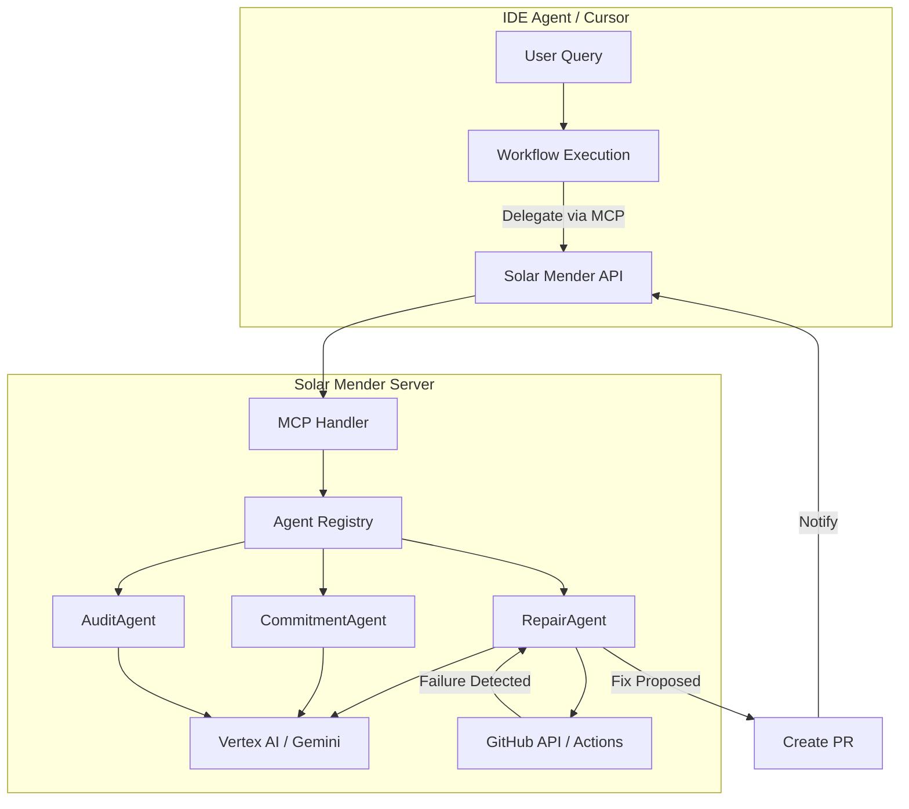

# MCP Integration Guide

This document describes how Solar Mender integrates with IDE agents (like Cursor) via the Model Context Protocol (MCP) to enhance development workflows.

## Overview

Solar Mender exposes MCP tools and resources that allow IDE agents to delegate complex, long-running, or observational tasks to the server-side agent system. This enables the IDE agent to act as a **coordinator** rather than a manual executor of workflows.

## Architecture



## MCP Tools

### 1. `mender.monitor_deployment`

**Purpose**: Delegates deployment monitoring to Solar Mender. The server watches a GitHub Actions run and automatically triggers repair if it fails.

**Input Schema**:
```json
{
  "run_id": "string (required)",
  "repo_name": "string (required)"
}
```

**Response**:
```json
{
  "job_id": 123,
  "status": "monitoring|repair_triggered|completed",
  "message": "Status message"
}
```

**Usage Example**:
```python
# IDE agent calls MCP tool
result = await mcp_client.call_tool(
    "mender.monitor_deployment",
    {
        "run_id": "123456789",
        "repo_name": "diviora/solar-mender"
    }
)
```

**Workflow Integration**: Replaces manual `gh run watch` and manual log analysis in `.workflows/deploy_until_success.md`.

---

### 2. `mender.craft_commit`

**Purpose**: Generates high-fidelity, "human-grade" commit messages that explain the "Why" behind changes, not just the "What".

**Input Schema**:
```json
{
  "diff": "string (required)",
  "context": "string (optional)"
}
```

**Response**:
```json
{
  "commit_message": "Subject line\n\nBody explaining why...",
  "logical_groups": [
    {
      "files": ["path/to/file1.py"],
      "description": "Added authentication",
      "rationale": "Why this change was made"
    }
  ]
}
```

**Usage Example**:
```python
# IDE agent calls MCP tool
result = await mcp_client.call_tool(
    "mender.craft_commit",
    {
        "diff": git_diff_output,
        "context": "Adding retry logic for API timeouts"
    }
)
```

**Workflow Integration**: Replaces manual commit message crafting in `.workflows/commit.md`. The server has access to full project history and architectural context.

---

### 3. `mender.remote_build`

**Purpose**: Triggers a build in a remote environment (GitHub Actions). In full implementation, would monitor and self-heal.

**Input Schema**:
```json
{
  "branch": "string (optional, default: 'main')",
  "repo_name": "string (required)"
}
```

**Response**:
```json
{
  "status": "not_implemented|triggered|monitoring",
  "message": "Status message",
  "branch": "main",
  "repo_name": "diviora/solar-mender"
}
```

**Workflow Integration**: Offloads build execution from local environment in `.workflows/workflows/build-and-fix.md`.

---

## MCP Resources

### 1. `mender://audit/latest`

**Purpose**: Provides the latest comprehensive codebase audit results.

**MIME Type**: `application/json`

**Access**: GET `/api/v1/resources/audit/latest`

**Response**:
```json
{
  "status": "completed",
  "timestamp": "2024-01-15T10:30:00Z",
  "findings": [
    {
      "severity": "high|medium|low",
      "category": "security|performance|technical-debt",
      "description": "Issue description",
      "recommendation": "Suggested fix"
    }
  ],
  "summary": {
    "total_findings": 15,
    "high_severity": 2,
    "medium_severity": 8,
    "low_severity": 5
  }
}
```

**Usage Example**:
```python
# IDE agent reads MCP resource
audit_data = await mcp_client.read_resource("mender://audit/latest")
```

**Workflow Integration**: Provides instant access to audit results without running full audit workflow in `.workflows/workflows/audit-system.md`.

---

### 2. `mender://audit/recent`

**Purpose**: Lists recent audit runs with metadata.

**MIME Type**: `application/json`

**Access**: GET `/api/v1/resources/audit/recent?limit=10`

**Response**:
```json
{
  "audits": [
    {
      "id": 1,
      "timestamp": "2024-01-15T10:30:00Z",
      "scope": "full",
      "findings_count": 15,
      "status": "completed"
    }
  ]
}
```

---

## API Endpoints

### MCP Tool Invocation

**Endpoint**: `POST /api/v1/mcp/invoke`

**Request**:
```json
{
  "tool_name": "mender.craft_commit",
  "arguments": {
    "diff": "...",
    "context": "..."
  }
}
```

**Response**:
```json
{
  "success": true,
  "result": {
    "commit_message": "..."
  }
}
```

### Agent Discovery

**Endpoint**: `GET /api/v1/agents`

**Response**: List of all registered agents with metadata.

**Endpoint**: `GET /api/v1/agents/{agent_name}/tools`

**Response**: List of MCP tools exposed by the agent.

**Endpoint**: `GET /api/v1/agents/{agent_name}/resources`

**Response**: List of MCP resources exposed by the agent.

---

## Implementation Details

### Tool Handler Architecture

All MCP tools are routed through `/api/v1/mcp/invoke` which:

1. **Discovers the tool** across all registered agents
2. **Routes to appropriate handler** based on tool name
3. **Executes the tool** using the agent's `invoke()` method
4. **Returns structured response** with success/error status

### Agent Registration

Agents are registered in `app/core/agents.py` via the `register_agents()` function. Each agent:

- Implements `BaseAgent` interface
- Exposes MCP tools via `get_mcp_tools()`
- Exposes MCP resources via `get_mcp_resources()`

### Error Handling

All MCP tool invocations return `MCPToolResponse` with:
- `success`: boolean indicating success/failure
- `result`: tool result (if successful)
- `error`: error message (if failed)

---

## Workflow Enhancements

### Before MCP Integration

1. IDE agent manually runs `gh run watch`
2. IDE agent manually reads logs on failure
3. IDE agent manually attempts fixes
4. IDE agent manually crafts commit messages
5. IDE agent manually runs audits

### After MCP Integration

1. IDE agent calls `mender.monitor_deployment` → server handles monitoring
2. IDE agent reads `mender://audit/latest` → instant audit results
3. IDE agent calls `mender.craft_commit` → server generates high-fidelity messages
4. IDE agent calls `mender.remote_build` → server handles build execution

---

## Future Enhancements

1. **Background Monitoring**: Implement Cloud Tasks with delays for deployment monitoring
2. **Scheduled Audits**: Add scheduled audit runs using Cloud Scheduler
3. **Build Sandbox**: Full implementation of remote build with GitHub Actions API
4. **Resource Caching**: Cache audit results for faster access
5. **WebSocket Updates**: Real-time updates for long-running operations

---

## See Also

- [Workflow Evolution Guide](docs/WORKFLOW_EVOLUTION.md) - Strategic overview
- [API Documentation](README.md) - Full API reference
- [Base Agent Interface](agent/base.py) - Agent implementation guide
