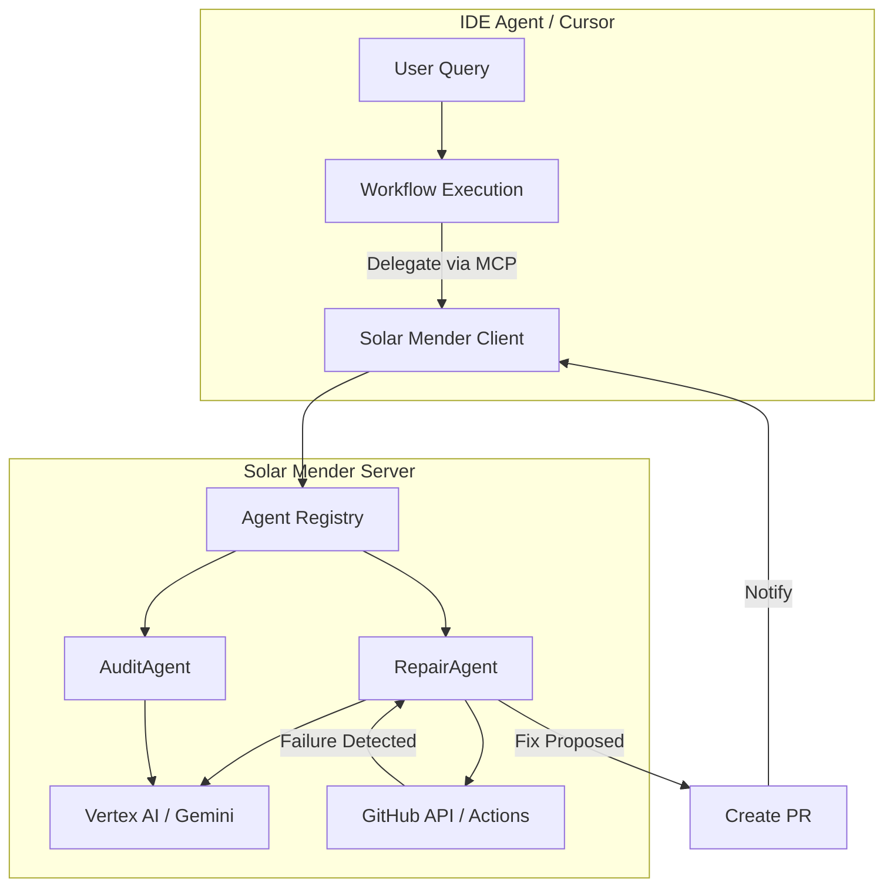

# Workflow Evolution: Solar Mender x MCP

This document outlines the strategic integration of Solar Mender (server-side agents) with the IDE agent (Cursor) using the Model Context Protocol (MCP). The goal is to evolve from manual workflow execution to a delegated, autonomous system.

## Core Philosophy: The "Delegate" Pattern

Currently, the IDE agent (Cursor) manually follows steps in `.workflows/`. In the evolved system, the IDE agent acts as a **Coordinator**. It delegates long-running, complex, or purely observational tasks to the Solar Mender server via MCP tools and resources.

## Strategic Improvements

### 1. Autonomous Deployment & Recovery
- **Current State**: IDE agent runs `gh run watch`, manually reads logs on failure, and manually attempts fixes.
- **Evolved State**: IDE agent triggers a deployment and then calls an MCP tool to delegate monitoring.
- **MCP Tool**: `mender.monitor_deployment(run_id: str)`
- **Workflow Integration**: `.workflows/deploy_until_success.md`
- **Impact**: The IDE agent is freed up to work on other tasks. Solar Mender's `RepairAgent` takes over monitoring, log analysis, and automated PR creation for fixes.

### 2. Deep System Audits (Background)
- **Current State**: IDE agent manually runs `/audit-system` which takes significant context and time.
- **Evolved State**: Solar Mender runs scheduled audits across the entire codebase using Gemini 1.5 Pro.
- **MCP Resource**: `mender://audit/latest`
- **Workflow Integration**: `.workflows/workflows/audit-system.md`
- **Impact**: Audits are more comprehensive as they aren't limited by the IDE agent's session context. Results are instantly available to the IDE agent via a standard URI.

### 3. High-Fidelity "Human" Commits
- **Current State**: IDE agent follows complex rules in `.workflows/commit.md` to avoid "AI-style" messages.
- **Evolved State**: IDE agent sends the diff to a specialized node in Solar Mender.
- **MCP Tool**: `mender.craft_commit(diff: str, context: str)`
- **Workflow Integration**: `.workflows/commit.md`
- **Impact**: Solar Mender can leverage cross-file context, previous commit history, and the `IMPLEMENTATION_PLAN.md` to craft commit messages that explain the "Why" with deep project awareness.

### 4. Remote Build & Healing
- **Current State**: IDE agent runs local builds and fixes errors one-by-one.
- **Evolved State**: IDE agent delegates the build loop to a server-side environment.
- **MCP Tool**: `mender.remote_build(branch: str)`
- **Workflow Integration**: `.workflows/workflows/build-and-fix.md`
- **Impact**: Offloads compute-intensive build processes. Solar Mender can run multiple healing iterations in parallel or in a specialized sandbox without blocking the developer's local environment.

## Integration Architecture

## Implementation Status

### ✅ Completed

1. **MCP Base Layer**: Updated `BaseAgent` with comprehensive MCP tool/resource documentation and patterns.
2. **Commit Specialist**: `CommitmentAgent` exposes `mender.craft_commit` tool for smart commit generation.
3. **Deployment Monitor**: `RepairAgent` exposes `mender.monitor_deployment` tool for delegating deployment monitoring.
4. **Audit Resource**: `AuditAgent` exposes `mender://audit/latest` and `mender://audit/recent` resources.
5. **MCP API**: Full API implementation at `/api/v1/mcp/invoke` for tool invocation.
6. **Resource API**: Resource endpoints at `/api/v1/resources/audit/*` for MCP resource access.

### 📋 Implementation Details

#### MCP Tool Handler (`app/api/mcp.py`)
- Unified endpoint for all MCP tool invocations
- Tool discovery across all registered agents
- Specialized handlers for each tool type
- Comprehensive error handling

#### RepairAgent Enhancements
- `mender.monitor_deployment` tool implementation
- Background monitoring with automatic repair trigger
- Job tracking in database

#### CommitmentAgent MCP Tools
- `mender.craft_commit` tool fully implemented
- Leverages Gemini 1.5 Pro for high-fidelity messages
- Follows "Why vs What" guidelines from `.workflows/commit.md`

#### AuditAgent System
- Base agent implementation with MCP resource support
- Placeholder for full audit implementation
- Resource endpoints for audit results

### 🔄 Future Enhancements

1. **Background Monitoring**: Cloud Tasks with delays for deployment monitoring
2. **Scheduled Audits**: Cloud Scheduler integration for periodic audits
3. **Full Audit Implementation**: Complete audit agent with codebase scanning
4. **Remote Build**: Full GitHub Actions API integration
5. **Resource Caching**: Cache audit results for performance

## API Endpoints

### Tool Invocation
- `POST /api/v1/mcp/invoke` - Invoke any MCP tool

### Resource Access
- `GET /api/v1/resources/audit/latest` - Latest audit results
- `GET /api/v1/resources/audit/recent` - Recent audit runs

### Agent Discovery
- `GET /api/v1/agents` - List all agents
- `GET /api/v1/agents/{name}/tools` - Agent's MCP tools
- `GET /api/v1/agents/{name}/resources` - Agent's MCP resources

See [MCP Integration Guide](MCP_INTEGRATION.md) for full API documentation.
